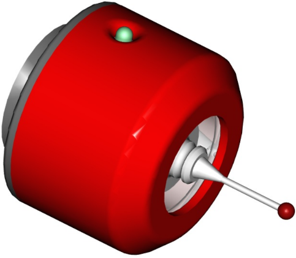
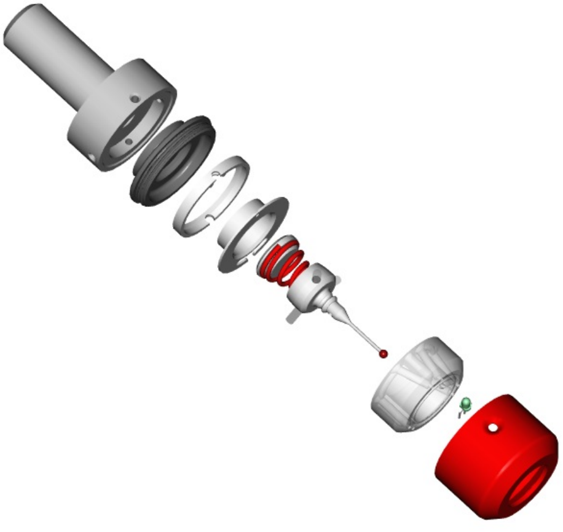

# A Mostly Printed Probe
A mostly printed kinetic probe for CNC machines. There is an old adage: "If you can't make it accurate, make it adjustable." 

3D printing accuracy is often hard to achieve, especially on a variety of printers, but 

This probe has been designed to work within ththe accuracy contraints of 3D printing and has proven to provide remarkable repeatability:

After my 21 year old ebay 'bargain' Renishaw gave up the ghost, I needed a probe quickly to continue developing my [CNC Probe Interface](https://github.com/Stutchbury/CNCProbeInterface) so designed one to turn on the lathe but the test 3D printed version worked so well, it is now an official side project...

With the exception of the 3mm diameter pins and the stylus, all of this probe is able to be FDM printed - even the spring is made from a length of filament! Only one part (the top) requires supports.

There are two different bodies - one is wired only and the second can also accommodate a 3mm LED (single or bi-colour). The non-LED version requires no soldering.

This is the first build, it is fairly compact at 38mm diameter x 28mm tall. The 25mm/30° taper allows concentricity to be tuned in on a mandrel.

As with all mechanical kinetic probes, this will work best with a [resistive switching interface](https://github.com/Stutchbury/CNCProbeInterface) but will also work fine as a plain old NC (normally closed) switch.

## Materials & Tools Required

A quick list of things you'll need - I will create a proper print/build guide VSN.

- **Pins** - I have used 3mm tungsten carbide rods, but any decently conductive metal would work and is probably a lot easier to cut. Search for "3mm dowel pins" for pre-cut hardened steel ones.

  - 9off 3mm diameter by 11.5mm - 12mm length.

- **Filament** - I used plain old PLA on a rather old & tired Ender 3.

- **Accurate 3mm drill** or reamer (measure your drills, they vary a lot).

- **M3 tap** - to fit the stylus and optionally the spring tensioner.

- **Thin stranded wire** - as fine as you can. I stripped out a ribbon cable but old USB charging cables are a good source.

All the STLs are available [here](stl/). There are also a couple of example mandrels for fitting into your spindle that enable concentricity to be tuned in.

## Slicing and Printing

A slicing and printing guide is available [here](docs/PRINTING.md).
