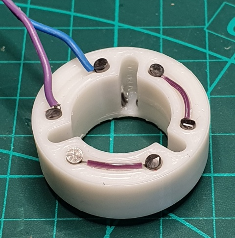
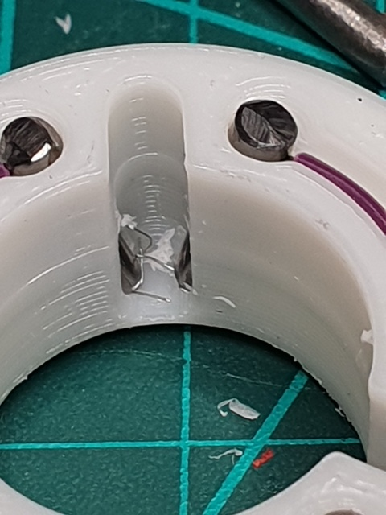

# Assembling the Mostly Printed Probe

This document is a work in progress - it takes a lot longer to document the assmbly than it does to actualy do it...

Once you have all the parts printed, it should be fairly self explanatory but here's a heads up on wiring the contacts:

*Very* thin stranded wire is held in place by the pins (if you don't want/need an LED, then no soldering is required).

Just make sure you pick out any loose strands or bits of plastic from between the pins.

Note: for newer versions (anything after v1.0..0), make sure both jumper wires and pins are flush or below the top surface - some of my pins in the picture above are a little long. The connector wires have a slot cut for them in the pin cover.

## Making the Spring

___WARNING!___ 

 

___****** DO THIS AT YOUR OWN RISK! ******___

**Making the spring involves *very* hot water and a risk of scalding - do not attempt unless you are properly protected.**

For the spring, warm about a foot (30cm) of filament in hot water, poke it through the hole at the bottom, wrap two turns on the flat, then up the helix and another two or three turns on the narrow flat section. Depending on how old/inflexible your filamant is, you may need to keep running under hot water.

Once fully wound (it will try to spring off), wrap tightly in painters tape (thanks Chris NS), hold onto the ends and dunk the turned parts into near-boiling water for a second or so* then under a cold tap. This will raise the filament to (or near) it's plastic temperature and then set it.

\* you can tell when it is 'done' by gently pulling one of the loose ends - as you feel it start to stretch, it is ready for a cold dunk.

If you haven't wrapped with painters tape, it is safer to dunk & chill one end at a time, so you can hold a cold end of the mandrel.

The narrow end will probably loosen but this can be re-dunked and tightened by holding on to the cold end of the mandrel and the cold end of the filament.

***Unless you have asbestos hands, wear protective gloves and take all necessary precautions.***

Once again: ___****** DO THIS AT YOUR OWN RISK! ******___
