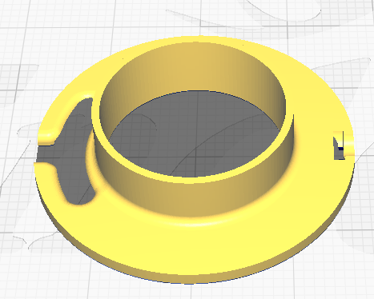
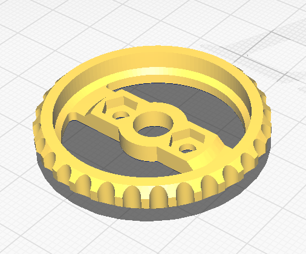

# Printing the Mostly Printed Probe

This guide is for FDM printing the Mostly Printed Probe. All models are [here](../stl).

## Tolerances

Most of the models have fairly relaxed tolerances with the accuracy of the probe being defined by the bearing faces shown above in blue - in particular, the 45° faces inside the body and on the bottom of the sleeve.

### Threads

Yes, the large threads work just fine in a 3D printed model!

The M3 threads in the lid (for the spring tension) and spider (for the stylus) need to be carefully cut with a tap. A [threading guide](../stl/MostlyPrintedProbe-PartSpiderTappingTool.stl) is provided to help align the tap with the spider.

The main M36 x 1.5mm thread (that secures the top to the body and compresses all the bearing faces) can provide some challenges. The thread itself has a generous tolerance built in, but there are many factors to acheiving a good thread but all can be resolved in the slicer.

Note: The main threads are now at an 80° thread angle rather than the standard 60° - this helps printing overhangs without support.

#### Shrinkage
The first lid & body I printed fitted perfectly (yes, I know, I'm was as surprised as you are) but when I re-printed the body in red, the diameter shrank. The same filament from the same manufacturer but in black, did not.

I have created two test nodels that I suggest are printed with your filament of choice. There is an [internal thread](../stl/MostlyPrintedProbe-PartTestInternalThread.stl) to represent the main body and an [external thread](../stl/MostlyPrintedProbe-PartTestExternalThread.stl) for the lid.

Print the internal thread (or the main body if you're feeling confident) first and then match the external thread to it. If your filament is similar to mine, it should fit first time, otherwise, scale and re-print the external thread and apply these settings to the lid slicing. Clean up the seam inside the thread hollows and lubricate with a soft pencil to prevent the stickyness of some filaments.

The test prints have grips on the perimeter but if you get the real lid stuck, there's a [spanner](../stl/MostlyPrintedProbe-ParLidSpanner.stl) for it!

#### Sagging
If your filament is too hot, the thread overhangs ~~(they are at 60°)~~ can sag a little, so playing with the temperature can help. The new 80° thread angle should significantly mitigate this issue.

#### Sticktion
Some filaments, especially shiny PLA, have a nasty habit of sticking to each other. Your thread may be perfect but the think just wants to stick. Matt PLA seems to work much better.

Use graphite (a soft pencil) to lubticate the threads and make sure the seams is cleaned out of the thread grooves.

Use the lid spanner to free a stuck thread.

#### Cross threading

An M36 x 1.5mm thread is *really* easy to cross thread - especially when the wires are not allowing the spacers to sit flat. Check the thread works wih just the lid and body (I'm sure you would anyway...) but be exceedingly careful as once cross threaded, plastic threads are very difficult to 'get back'. If it doesn't start easily & reliably, then final assembly gets a bit fractious.

## Slicing & Printing

I'm using Cura at 0.2mm layer height. Sometimes the slicer will report errors in the STLs but then automagically repair them and print just fine. I'm working on resolving this but as everything prints OK, it is a little down the priority list.

**A Note on Seams:** Unless you are able to truly hide your Z seam (ie no blobs), I recommend having a single seam that can be filed or scraped flat where required.

Unless otherwise specified, I am using 4 walls and the default infill. Only one part need supports.

### Sleeve 

- Filament required: 7g, 2.25m
- Support: Not required

The pin holes are (in theory) exactly 3mm diameter - they can by adjusted with 'Hole Horizontal Expansion' in Cura but unless they are coming out loose, then leave as is because we'll be reaming or drilling them in the assembly.

The small holes in the underside are to ease the rmoval of the pins, so if you think you might need that, clean them out too.

File the seam away on the lower 45° outer face.

### Main Body

- Filament required: 8g, 2.58m
- Support: Not required

There may be a little sagging at the top of the cable/LED holes but these are easily resolve with a 3mm drill.

Ensure in the preview there are no odd concentric gaps in the walls - they should be solid.

Scrape the seam away on the inner 45° face. A sharp flat-bladed screwdriver works well.

### Top

- Filament required: 5g, 1.7m
- Support: **Required**

An apparently happy part, but despite this, needs support. We are printing in this orientation because the bottom of the thread and the wide upper face need to be parallel. The underside edge at the top of the threads shouldn't actually touch the main body when screwed in.

### Spider

- Filament required: 2g, 0.69m
- Support: Not required
- Print Orientation: Upside down

I printed this solid (eg 10 walls) as the three pins will try to split the layers as you push them in.

### Pins Cover

- Filament required: 1g, 0.35m
- Support: Not required

Check the thickness of the wide lip - it should be ~0.8mm-1mm (4 layers). If your printer squishes the first layer, you may need to print a slightly taller spaces.

### Spacer

- Filament required: 1g, 0.22m
- Support: Not required

Every project needs a spacer! No supports required but print upside down.

If your top tightens on the body before clamping the sleeve, then scale this part in Z as required.

This part also holds the (optional) LED in place.

### Spring Top

- Filament required: 1g, 0.35m
- Support: Not required
- Print orientation: Upside down

This sits on top (well, screws into) the top of filament-made spring to 'level out' the coils.

## Tools

These are utility prints to assist with the assembly.

### Top Spanner

- Filament required: 3g, 1.08m
- Support: Not required

Add two M3 x 8mm screws and nuts to create a pin spanner and help unscrew the top from the base (when, not if, it sticks).

#### Spider Pin Guide

- Filament required: 2g, 0.73m
- Support: Not required

Used to ensure the spider's pins stick out just the right amount.

#### Spider Threading Guide

- Filament required: 3g, 1.02m
- Support: Not required

Sits on the spider's pins to provide a guide for the M3 tap.

#### Spring Mandrel

- Filament required: 3g, 0.94m
- Support: Not required

Used to wrap filament and 'set' using hot/cold water.

If you have any higher temperature filament, this might benefit, but I used PLA.

### Spindle Mandrels

- Filament required: 12-17g 4.09-5.76m
- Support: Required

Not strictly part of the Mostly Printed Probe but provided for testing and modelling. Ideally these shoulb be turned out of metal as this is the bit that is regularly tightened into the spindle.

The four M3 threads allow you to tune in concentricity of the stylus.

